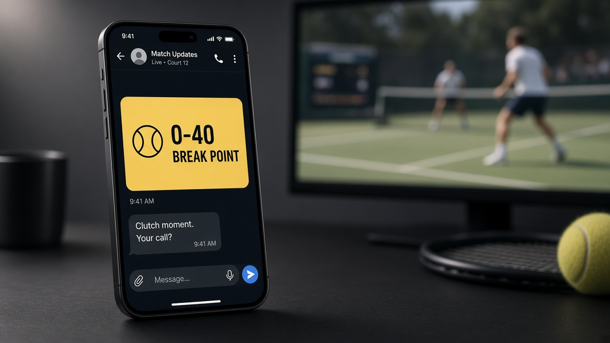
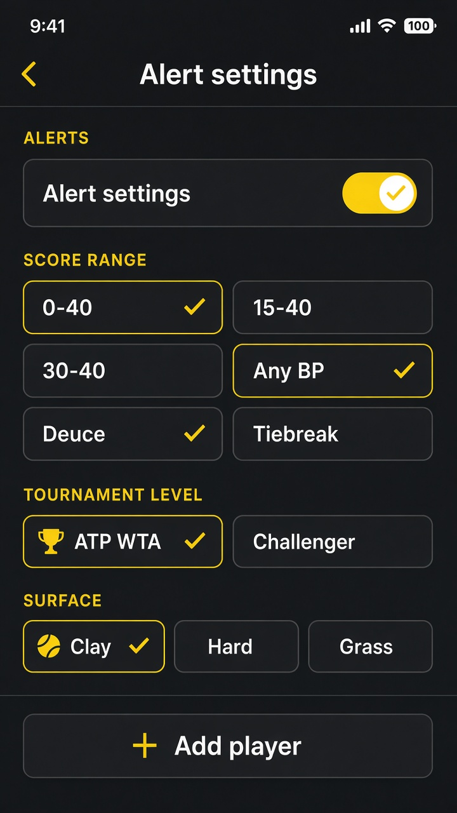

# Tennis Trader Alerts — instant Telegram tennis break-point alerts

[](https://github.com/stephanepatteux/tennis-trader-alerts/actions/workflows/ci.yml)
[](LICENSE)
[](https://www.python.org/)
[](https://affiliates.livetennisapi.com/r/botblog?utm_campaign=live-tennis-ultra&utm_medium=tennis-alerts&utm_source=github)

A self-hosted **Telegram alerter for Betfair tennis traders**. It watches live
ATP &amp; WTA matches over the **Live Tennis API Ultra WebSocket** and pings your
phone the instant a game hits **0–40**, **15–40**, **30–40**, any break point,
deuce or tiebreak — point-by-point, **no polling**. Pair it with the
[Tennis Trader Board](https://github.com/stephanepatteux/live-tennis-scoreboard)
on a second screen. Scores are informational — **not tips**.




> ## ⚡ Real-time push requires a Live Tennis API **Ultra** key
>
> **You get 10% off Ultra with code `botblog`.**
> Checkout: enter **`botblog`** (one word, lowercase) and the Ultra plan is
> **10% cheaper**. Then paste your key into `.env`.
>
> **[Subscribe to Ultra — 10% off with code botblog](https://affiliates.livetennisapi.com/r/botblog?utm_campaign=live-tennis-ultra&utm_medium=tennis-alerts&utm_source=github)**
>
> The point-by-point push feed is **Ultra-only**. Lower plans cannot open it.
> _[Why Ultra is required](#why-an-ultra-key-is-required-for-real-time-push) ·
> [Affiliate disclosure](#affiliate-disclosure)._

## Contents

- [Who it's for](#who-its-for)
- [What to expect](#what-to-expect)
- [Why an Ultra key is required](#why-an-ultra-key-is-required-for-real-time-push)
- [Features](#features)
- [What you need](#what-you-need-nothing-is-bundled)
- [Quick start](#quick-start)
- [Bot menu](#bot-menu)
- [Configuration](#configuration)
- [Deploy](#deploy)
- [FAQ](#faq)
- [Affiliate disclosure](#affiliate-disclosure) · [Disclaimer](#disclaimer)

## Who it's for

Betfair (and other exchange) **in-play tennis traders** who want the 15–40 / 0–40
moment on their phone the instant it is scored — not after the next poll, and
not buried in a scoreboard tab. If you trade tennis Match Odds and want to *see
the point before the market reacts*, this is for you.

## What to expect

**Two pieces, one process:**

| Piece | What it does |
| ----- | ------------ |
| **Ultra worker** | One WebSocket to Live Tennis API. Every score commit is mapped and checked for break-point / deuce / tiebreak. |
| **Telegram bot** | Sends the alert, and lets **each chat** manage its own triggers and filters from a menu. |

On each rising-edge trigger you get a message with the players, tour, surface,
sets / games / points, and who is serving. A 15–40 that sits for three points is
**one** message, not three. `/off` pauses without wiping filters.



## Why an Ultra key is required for real-time push

**The whole point of this service is that a break point hits Telegram the moment
it is played.** That "server pushes each point to you" model is only available
on Live Tennis API's **Ultra** plan. Here is exactly why, and why lower tiers
can't do it:

### Push vs. polling — two fundamentally different mechanisms

- **Polling (lower tiers): _you_ ask, on a timer.** Free/basic keys expose only
  the REST endpoints (e.g. `GET /matches?status=live`). To follow a match you
  have to call that endpoint again and again. Between two calls you are blind —
  a break point can come and go before your next request. You also can't call it
  fast: the free plan is capped at **30 requests/min and 100 requests/day**, so
  "every few seconds" burns quota almost immediately, and you still only see the
  score as it was at each poll.
- **Push (Ultra): _the server_ tells you, the instant it changes.** Ultra opens
  a **WebSocket**. You connect once and the server sends a frame **on every
  score commit** — i.e. on every point — with no request from you and no
  polling. That is the only way to get true point-by-point, zero-delay alerts.

### The push feed is gated to Ultra by the API itself

Real-time push is minted through `GET /ws-token`, documented as **"Plan
required: ULTRA."** With a lower-tier key the token request is rejected
(HTTP 401/403), so **there is no WebSocket to connect to** — it is not a client
setting we can toggle.

### This worker is push-only on purpose

There is **no polling fallback**. Without an Ultra key the process exits and
tells you why. Add an
[Ultra key](https://affiliates.livetennisapi.com/r/botblog?utm_campaign=live-tennis-ultra&utm_medium=tennis-alerts&utm_source=github)
(**10% off** with code **`botblog`**) and it connects to the Ultra WebSocket
and alerts on real matches, point by point.

> **No API key ships with this project.** This repository contains **no key at
> all** — not even a hidden or example one. You buy your own Live Tennis API
> Ultra key and create your own Telegram bot, then supply both at runtime via
> `LIVE_TENNIS_API_KEY` and `TELEGRAM_BOT_TOKEN` (kept in an untracked `.env`,
> never committed).

```
Telegram  ◀── sendMessage / getUpdates ──  this worker  ── WebSocket ──▶ Live Tennis API Ultra
                                           (GET /ws-token → connect → subscribe → rising-edge)
```

Your **API keys stay on the server**. The Ultra key is sent to Live Tennis API
as an `Authorization: Bearer` header; the Telegram token is used only to call
Bot API methods. Neither is committed to this repo.

## Features

- Real-time point-by-point **Ultra WebSocket** (ported from the trader board):
  token mint, reconnect with a fresh token, heartbeat reply, score-frame mapping.
- Local alert detection — same codes as the board: `0–40`, `15–40`, `30–40`,
  any break point, deuce, tiebreak.
- **In-bot menu** so each Telegram user manages their own triggers, tour,
  surface, player watchlist, and pause/resume. Saved to `data/rules.json`.
- **Rising-edge de-dup** and **per-chat rate limiting**.
- Telegram Bot API `sendMessage` (HTML). `--dry-run` logs the same text.

## What you need (nothing is bundled)

This repository is **code only**. It does **not** include a Live Tennis API key
or a Telegram bot token — not even a sample. You bring both:

| You need | Cost | How |
| -------- | ---- | --- |
| **This code** | Free | Clone the repo. |
| **Live Tennis API Ultra key** | Paid (Ultra plan) | **[Subscribe to Ultra](https://affiliates.livetennisapi.com/r/botblog?utm_campaign=live-tennis-ultra&utm_medium=tennis-alerts&utm_source=github)** and enter code **`botblog`** at checkout for **10% off**. Lower plans cannot open the push feed. |
| **Telegram bot token** | Free | Talk to [@BotFather](https://t.me/BotFather) → `/newbot` → copy the token. |

Put both values in a local `.env` on **your** machine. Never commit that file.

## Quick start

**1. Create the Telegram bot**

In Telegram, open [@BotFather](https://t.me/BotFather), send `/newbot`, and copy
the token it gives you (looks like `123456:ABC…`).

**2. Buy an Ultra key (10% off with code `botblog`)**

1. Open **[this affiliate link](https://affiliates.livetennisapi.com/r/botblog?utm_campaign=live-tennis-ultra&utm_medium=tennis-alerts&utm_source=github)**.
2. At checkout, enter promo code **`botblog`** — that is **10% off** the Ultra plan.
3. Copy the API key from your Live Tennis API dashboard.

**3. Install and configure**

```bash
git clone https://github.com/stephanepatteux/tennis-trader-alerts.git
cd tennis-trader-alerts

python3 -m venv .venv
source .venv/bin/activate          # Windows: .venv\Scripts\activate
pip install -r requirements-dev.txt

cp .env.example .env
```

Open `.env` in a text editor and paste your two secrets (no quotes):

```
LIVE_TENNIS_API_KEY=paste_your_ultra_key_here
TELEGRAM_BOT_TOKEN=paste_your_botfather_token_here
```

Optional but recommended — lock the bot to you so strangers cannot `/start` and
burn your Ultra quota. Message [@userinfobot](https://t.me/userinfobot), copy
your numeric **Id**, and set:

```
TELEGRAM_ALLOWED_CHATS=123456789
```

**4. Run it and open the menu**

```bash
python -m app
```

Leave that terminal open. In Telegram, search for **your** bot (the name you
gave BotFather), tap **Start** or send `/start`. Use the buttons to pick
0–40 / 15–40 / any break point / deuce / tiebreak, and optional tour, surface,
or player filters.

If `.env` was missing a key, the process exits with a clear error. Fix `.env`
and run `python -m app` again.

`python -m app --dry-run` still needs the Ultra key (it must consume the live
feed) but **logs** alerts instead of sending them. Tests need no keys:
`pytest`.

## Bot menu

After `/start`, Telegram shows a persistent keyboard (**⚙️ Menu**, **Status**,
**Pause**, **Resume**) and an inline settings panel:

- Toggle **0–40 / 15–40 / 30–40 / Any BP / Deuce / Tiebreak**
- Filter **ATP / WTA** and **Clay / Hard / Grass** (all-on = every match)
- **➕ Player** then type a name; tap **✕ name** to remove
- **Pause / Resume** without wiping filters

Commands also appear in Telegram's bot command list: `/menu` `/status` `/on`
`/off` `/help`.

To lock the bot to your chats, set `TELEGRAM_ALLOWED_CHATS` (or
`TELEGRAM_CHAT_ID`). Anyone already saved in `data/rules.json` keeps access.

## Configuration

All configuration is via environment variables — see
[`.env.example`](.env.example):

| Variable                  | Default                                       | Purpose |
| ------------------------- | --------------------------------------------- | ------- |
| `LIVE_TENNIS_API_KEY`     | _(required)_                                  | Live Tennis API **Ultra** key. Server-side only. |
| `LIVE_TENNIS_API_BASE`    | `https://api.livetennisapi.com/api/public/v1` | API base URL (`/ws-token` is minted from here). |
| `LIVE_TENNIS_API_TIMEOUT` | `10`                                          | Token-mint / connect timeout (seconds). |
| `TELEGRAM_BOT_TOKEN`      | _(required unless `--dry-run`)_               | Telegram bot token from @BotFather. |
| `TELEGRAM_CHAT_ID`        | _(optional)_                                  | Seed one chat; also used as the allowlist if `TELEGRAM_ALLOWED_CHATS` is empty. |
| `TELEGRAM_ALLOWED_CHATS`  | _(open, or `TELEGRAM_CHAT_ID`)_               | Comma-separated chat ids allowed to `/start`. |
| `RULES_PATH`              | `data/rules.json`                             | Per-user rules JSON (bot-written). |
| `ALERT_TRIGGERS`          | all of `0-40,15-40,30-40,break-point,deuce,tiebreak` | Env bootstrap triggers. |
| `ALERT_TOURS`             | _(all)_                                       | e.g. `atp` or `wta`. |
| `ALERT_SURFACES`          | _(all)_                                       | e.g. `clay,hard,grass`. |
| `ALERT_WATCHLIST`         | _(all)_                                       | Comma-separated player-name substrings. |
| `RATE_LIMIT_MAX`          | `20`                                          | Max Telegram sends per chat per window. |
| `RATE_LIMIT_WINDOW_S`     | `60`                                          | Rate-limit window (seconds). |
| `LOG_LEVEL`               | `INFO`                                        | `DEBUG` / `INFO` / `WARNING`. |

Operations notes (reconnect, rules reload, state): see
[`docs/OPERATIONS.md`](docs/OPERATIONS.md).

You can still edit [`data/rules.example.json`](data/rules.example.json) →
`data/rules.json` by hand. Empty `tours` / `surfaces` / `watchlist` = no filter.
Empty `triggers` = nothing fires. The worker reloads the file on change.

## Deploy

Set `LIVE_TENNIS_API_KEY` and `TELEGRAM_BOT_TOKEN` in the **host** environment —
never in the image or the repo. One process, one upstream Ultra WebSocket.

```bash
python -m app
```

### Docker

```bash
docker build -t tennis-trader-alerts .
docker run --rm \
  -e LIVE_TENNIS_API_KEY=your_ultra_key \
  -e TELEGRAM_BOT_TOKEN=your_bot_token \
  -v tta-data:/app/data \
  tennis-trader-alerts
```

Keys are passed at runtime and are **never baked into the image**. The volume
keeps bot-managed `rules.json` across restarts.

## Contributing

Contributions welcome — see [`CONTRIBUTING.md`](CONTRIBUTING.md). Please run
`pytest` (CI runs it too) and never commit secrets. Security reports: see
[`SECURITY.md`](SECURITY.md).

## FAQ

**Is this a Betfair betting bot?** No. It is a **read-only alerter**. It never
places bets and is not a Betfair API key.

**How is it different from Flashscore notifications?** Fan apps show results.
This is built for **Betfair tennis trading**: who is serving, 0–40 / 15–40
break-point alerts, ATP/WTA and surface filters, a player watchlist, and
point-by-point Ultra push so the ping can beat the market move.

**Do I need an API key?** Yes — a
**[Live Tennis API Ultra](https://affiliates.livetennisapi.com/r/botblog?utm_campaign=live-tennis-ultra&utm_medium=tennis-alerts&utm_source=github)**
key. Enter code **`botblog`** at checkout for **10% off**. The push feed is
Ultra-only. You also need a free Telegram bot token from @BotFather.
See [Why Ultra is required](#why-an-ultra-key-is-required-for-real-time-push).

**Why not just poll every few seconds?** Polling misses the exact moment a
point lands and burns rate-limited quota. The Ultra WebSocket pushes **every
point** with no delay — this worker is push-only by design.

**How do I choose which alerts I get?** `/start` or tap **⚙️ Menu**. Toggle
0–40 / 15–40 / 30–40 / any break point / deuce / tiebreak, filter ATP/WTA and
clay/hard/grass, and add players. `/off` pauses; `/on` resumes.

**Is my API key safe?** Yes. Keys are read from the environment server-side.
`.env` is git-ignored. The Ultra key is sent as a request header; the Telegram
token is used only in Bot API calls and is never written to logs.

**Can several phones share one worker?** Yes — each Telegram chat has its own
row in `data/rules.json`. Lock extras with `TELEGRAM_ALLOWED_CHATS`.

## Affiliate disclosure

Links to Live Tennis API on this page are affiliate links: if you subscribe
through them, this project may earn a commission at no extra cost to you.
**Promo code `botblog` is 10% off the Ultra plan** at checkout. You can also
sign up directly at [livetennisapi.com](https://livetennisapi.com).

## License

Released under the [MIT License](LICENSE) — free to use, modify, and self-host.

## Disclaimer

Not financial advice. Live scores are informational only. They are not tips and
do not place bets for you.

**18+ only. Please gamble responsibly** — see
[BeGambleAware](https://www.begambleaware.org/). Trading on betting exchanges
carries risk; only stake what you can afford to lose.

**Privacy:** the worker stores Telegram `chat_id`, optional display name, and
your trigger/filter choices in a local `data/rules.json` on the machine you
run it on. It sets no cookies, has no public HTTP site, and does not send that
file to us. Live scores are fetched from Live Tennis API; outbound messages go
to Telegram's Bot API.
